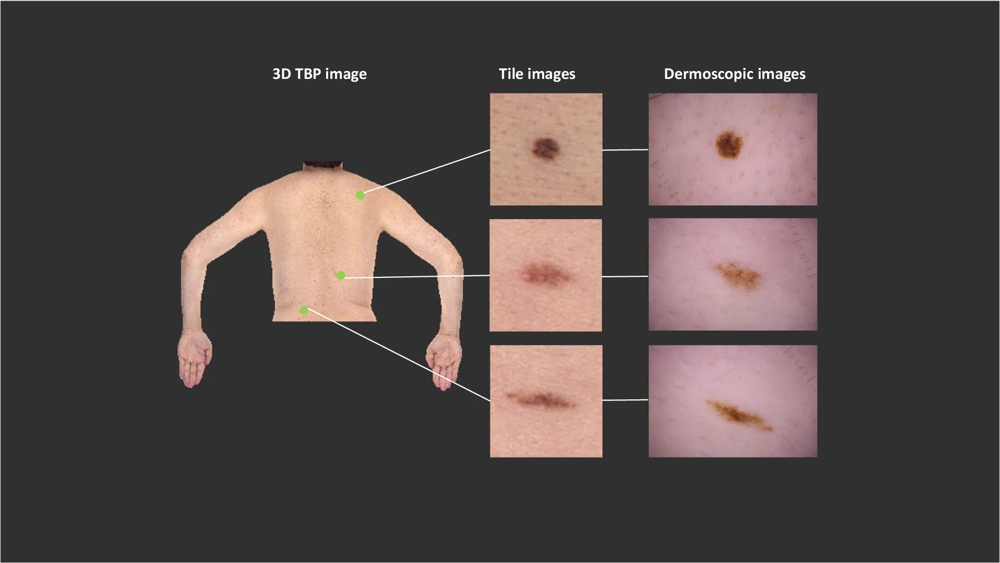

# ISIC-2024 Skin Cancer Classification
This project was developed as part of the ISIC-2024 Skin Cancer Classification competition on Kaggle, where the goal was to create an AI algorithm capable of identifying histologically confirmed skin cancer cases from 3D Total Body Photographs (TBP). The competition dataset included images with quality comparable to smartphone photos, aimed at improving triage for early skin cancer detection in settings lacking specialized dermatologic care.

I achieved a top **13%** ranking out of **3,782 participants**, with an Area Under the Curve (AUC) of **0.967** on the test set.

## Overview
The ISIC-2024 competition challenged participants to develop image-based algorithms to classify malignant skin lesions from benign ones using 3D TBP images. These images are similar in quality to those captured with smartphones, mimicking real-world scenarios where telehealth services or primary care settings lack access to specialized dermatological tools.

This project focused on designing a robust and efficient deep learning model capable of handling both image and tabular data, fusing multiple data modalities to enhance the model’s diagnostic capabilities.

## Competition Details
- **Host**: International Skin Imaging Collaboration (ISIC) on Kaggle
- **Objective**: Classify skin lesions as malignant or benign from single-lesion crops in 3D TBP images.
- **Evaluation Metric**: Partial AUC above 80% True Positive Rate.
For more information about the competition: [Kaggle competition link](https://www.kaggle.com/competitions/isic-2024-challenge/overview)

## Approach
Our approach incorporated custom deep learning architectures, feature engineering, and advanced training techniques to ensure optimal model performance. The key steps included:

1. **Custom Architecture Design**
    - **Backbones**: Utilized Vision Transformer (ViT) and EfficientNet models as backbones for image processing.
    - **Fusion with Tabular Data** : Incorporated patient metadata (age, sex, etc.) to improve model predictions by fusing image features with tabular patient data.
    - **Attention Mechanisms** : Explored self-attention layers to capture intricate patterns in skin lesion images.
2. Training Pipeline
    - **Gradient Scaling & Mixed Precision**: Implemented gradient scaling and mixed precision training to stabilize training and speed up convergence.
    - **Bayesian Optimization**: Utilized Bayesian optimization to fine-tune hyperparameters, improving overall performance.
    - **Data Augmentation**: Applied various augmentation techniques to increase model generalization and combat overfitting.
3. Model Performance
    - **AUC**: Achieved an AUC of 0.967.
    - **Top 13%** ranking in a global competition with over 3,782 participants.
## Dataset
The competition utilized the SLICE-3D dataset, containing over 400,000 distinct skin lesion images collected from seven dermatologic centers worldwide. These images are designed to resemble those captured via smartphones in non-clinical settings, making the challenge of accurately diagnosing skin cancer even more critical for underserved populations.

- **Image Quality**: Images are extracted from 3D TBP (Total Body Photography) photos, similar in quality to typical smartphone submissions used in telehealth.
- **Metadata** : Patient data such as age and sex were provided as tabular data for integration into models.
For a full description of the dataset: ISIC 2024 Dataset Abstract

Examples of image types. The SLICE-3D dataset is comprised of tile images, which were extracted from 3D TBP images.

## Best-Performing Model: LightMultiModalNN

Our best-performing model, **LightMultiModalNN**, is a multi-modal neural network that fuses image data from a Vision Transformer with tabular patient data to classify skin lesions as malignant or benign. The model leverages two key data streams: visual features extracted from skin lesion images and patient-specific metadata. Below is a detailed breakdown of the architecture and its theoretical foundations.

### Model Architecture

The model is composed of three main components:

1. **Image Feature Extractor (Vision Transformer)**:
   We use a pre-trained **EVA-02 Vision Transformer** (`eva02_small_patch14_336.mim_in22k_ft_in1k`), which has been fine-tuned on large image datasets. The Vision Transformer is responsible for extracting high-level image features from input images, which represent cropped lesions from 3D total body photographs (TBP).

   - **Backbone**: Vision Transformer (ViT) with small patch size (14x14).
   - **Pre-training**: Pre-trained on the `mim_in22k_ft_in1k` dataset, a large corpus of high-resolution images.
   - **Head Modification**: The original classifier head of the model is replaced with an identity layer (`nn.Identity()`), allowing us to extract feature embeddings instead of final classification outputs.

     
   Architecture diagram for backbone.  
  
2. **Tabular Data Network**:
   For the patient-specific metadata (age, sex, etc.), we construct a simple feed-forward neural network. This network processes **31 continuous features** and **6 binary features**, outputting a tabular representation that is combined with the image features.

   - **Input Features**: 31 continuous features (e.g., age, lesion size) and 6 binary features (e.g., gender, lesion location).
   - **Network Layers**: The tabular network consists of fully connected layers with SiLU (Swish) activations and dropout for regularization.
   - **Output Dimension**: The output dimension of the tabular network is **380**.

3. **Classification Head**:
   After extracting features from both image and tabular data, the two streams are concatenated and passed through a final classification head. The classifier is a two-layer fully connected network with a **GELU** activation function and dropout to prevent overfitting.

   - **Classifier Structure**: The classifier consists of a GELU activation function and dropout, followed by a final linear layer that outputs a single logit, representing the binary classification prediction (malignant or benign).

### Theoretical Rationale

The **LightMultiModalNN** model is designed to capitalize on the strengths of both image-based deep learning and tabular data processing:

- **Vision Transformer Backbone**: Transformers have shown state-of-the-art performance in various computer vision tasks, especially for complex images like skin lesions where fine-grained details are crucial for accurate classification.
- **Tabular Data Fusion**: Incorporating patient-specific metadata such as age, sex, and lesion characteristics allows the model to contextualize the image data, improving classification accuracy. For example, certain patient demographics are more likely to develop certain types of skin cancer, which the tabular network helps capture.
- **Combined Learning**: By concatenating the image and tabular features, the model learns a holistic representation that merges visual and clinical data, enabling a more accurate and informed decision-making process.

## Results
**Final Test PAUC**: 0.167  
**Rank**: Top 13% out of 3,782 participants  
**Evaluation**: pAUC above 80% TPR
